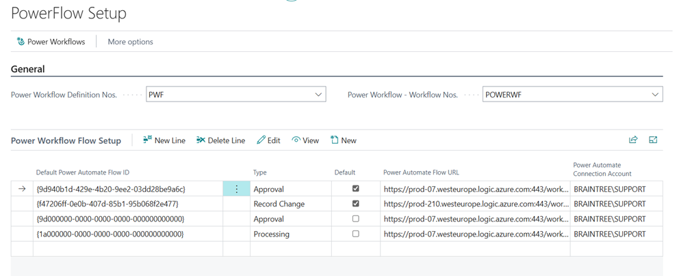
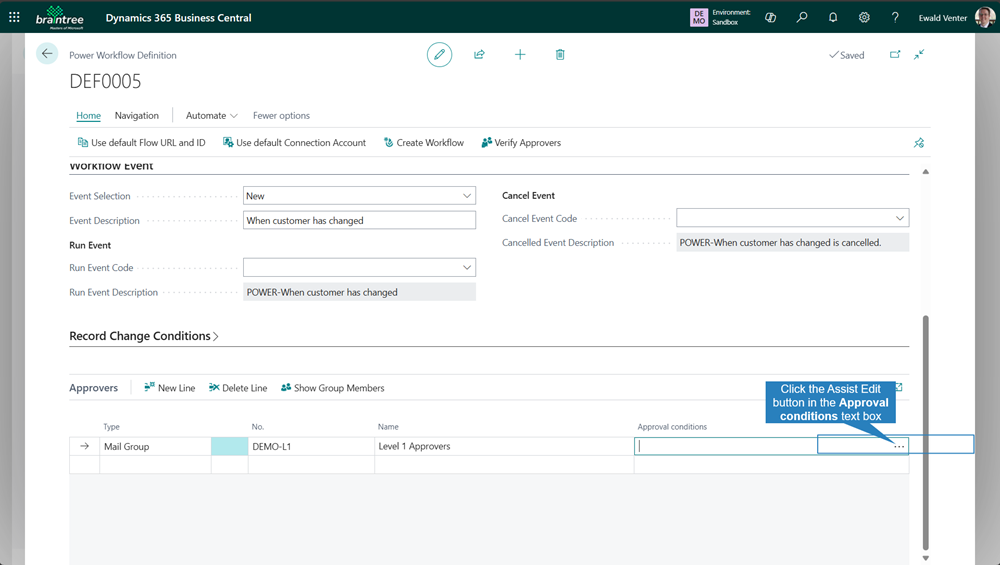
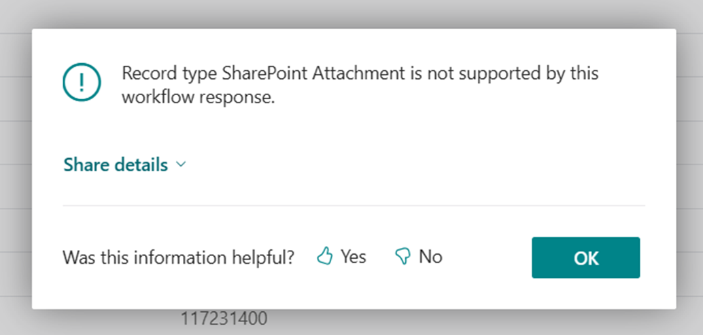

# PowerFlow

## 1. Introduction
The PowerFlow extension for Microsoft Dynamics 365 Business Central allows you to save time setting up workflows and extend it into the PowerPlatform.

The extension includes the following features:
**Flexible Workflow Types**
- Approval Workflows: Configure multi-level approval processes
- Record Change Workflows: Monitor and control field value changes 
- Processing Workflows: Automate business process sequences

**Power Automate Integration**
- Seamless integration with Microsoft Power Automate
- Custom webhook endpoints for workflow triggers
- Configurable connection accounts and flow URLs

**Advanced Field Monitoring**
In Standard Business Central, you either the approval is triggered either on everything, or on individual fields. I.e. if you wanted to track a change on 5 fields, you had to maintain 5 different workflows.
With PowerFlow, you specify all the fields you want to monitor, and maintain 1 workflow.
- Track changes to specific fields across Business Central tables
- Restore previous values if needed
- Configurable field change conditions

**Multi-Level Approval Management**
- Support for multiple approver types:
  - Security Groups
  - Mailing Groups
  - Individual Users
- Sequential approval routing
- Conditional approvers – This allows you to maintain 1 workflow, and have separate approvers for different conditions on a record. E.g. send Purchase Order approvals to different branch managers, regardless of the user, using just 1 workflow.
- Duplicate approver detection
- Approval status tracking

## 2. Activation

In Business Central, search for and open “Braintree App Licenses”

 

1.	Enter your e-mail address
2.	Select the PowerFlow entry
3.	Click Request Subscription/Trial License

We will activate an evaluation license and send it to the email address you specified. The mail will contain a license key. Copy that license key then return to the Braintree App Licenses.

 

1.	Select the PowerFlow entry
2.	Click Update License Key
3.	Enter the key on the page that opens and click Ok. You should get a message that states “Thank you for registering”

## 3. Process

### 3.1 PowerFlow Setup

Review setups

Each Type can be configured with a default PowerAutomate flow that will copy to the Power Workflow Definitions.
Click Edit to modify the Authentication for the Flow Setup.

> Note: The authentication is to match the PowerAutomate authentication method. Only users in my tenant relates to the Any user in my tenant option in PowerAutomate. If this is selected, you need to create a app registration in Azure, with the PowerAutomate User permission.
>
> 

Open Power Workflow Definitions
 

### 3.2 Create a new Record Change Power Workflow Definition

Enter **Workflow Description**

Set **Type** to *Record Change*

Select Customer table and lookup Page

Select Customer Card

Select the **Power Automate Flow Id** from lookup or click the **Use default Flow URL and ID **action

Set **Event Selection** to *New*
Add **Event Description** and click in the Field Name cell under Record Change Conditions

Select fields

Selected fields are populated in the Record Change Conditions

Add approvers

You can make use of Security Groups, Mail Groups and individual Users. 
It will sequentially send to everyone in the group. Everyone in the group must approve. If someone in the group rejects it, it will not go to the next person in that group and or to any subsequent approvers setup in this sequence.

Click the Approval conditions assist edit button

Add approver conditions

Add conditions for when this approver will be used.
The approvers on this line will only be used, if the Customer Posting Group on the Customer card is FOREIGN

Add second approver conditions, for when this approver will be used

Click the Create Workflow action

Duplicate Approver Warning

This is just a warning that potential duplicates have been detected, and you have to ensure that the conditions are setup correctly so that the same approver isn't used twice in an approval run.

Click the Yes to create new Run and Cancel Event Codes

Review and enable workflow

Open a DOMESTIC customer card

Change Name 2, Address and VAT Registration No.

Change to View mode

Changes have been reverted. Click the OK button

Open the Your Approval Required for changes made to email

Verify changes have been applied

### 3.3 Create a new Approval workflow for custom tables

> You can apply this logic to standard tables too and then only add additional fields and actions to pages as required

Extend `Workflow Trigger BTR` by adding 2 new options

Build table and verify OnDelete trigger is required

Create page

Update Workflow trigger Enum options

Update Workflow trigger Enum options

Get Approval Status

Check if approval request is possible

Required Variables

Test 1 - new record approval, create a new record

Click the Send Approval Request action, we are expecting an error

Create new Power Workflow Definition

Enter **Workflow Description** and select **Type** = *Approval*

Enable the **Enable Custom Trigger** and **PowerFlow Manages Status** toggle buttons
PowerFlow stores a separate record linked to this record and maintains the status there.

Select new custom table and lookup the page

Click the **Use default Flow URL and ID **action

Set Event Selection = New

Set workflow event details

Add approvers

Create workflow

Review and enable the workflow

Click the **Send Approval Request** action

Create new record and Send Approval Request

Review status

Open mail 1

Approve with comment

Open mail 2, reject with a reason

Approval outcome email confirmations

Result
The workflow response was set to "Reopen Document". One could just as well have used the "Reject Document" status to set the status to *Rejected*.

## 4. Extending

Events have been added in strategic places to allow you extend workflows by focusing on the business logic and less on the where and how to add the code.

Here is a list of events available to use:

| Object | Event | Usage Scenario |
| --- | --- | --- |
| codeunit 72449784 "PowerFlow Management BTR"    | OnBeforeRunWorkflow   |   Perform additional checks before a custom workflow is executed by a Workflow Trigger type.  |
|     |  OnBeforeCancelWorkflow   |   Perform additional checks before a custom workflow cancellation is executed by a Workflow Trigger type.  |
|     |   OnExecuteRunWorkflowOnAfterCheckApprovalPossible  |  For each matching workflow definition that is linked to the Workflow Trigger, after the Approval is Possible Check is performed, handle custom checks.   |
| codeunit 72449775 "Approval Management BTR"   |   OnCheckApprovalPossibleOnAfterCalcShowNothingToApproveError  |   Perform additional checks, e.g. if the document should go for approval, check if the lines on the document satisfies a custom condition, and return true if “Nothing to approve” error should then be raised.  |
|     |  OnAfterCheckApprovalPossible   |  Custom logic to execute or retain record detail when approval is possible.   |
| codeunit 72449776 "Record Approval Management BTR"   | OnBeforeCreateApprovalStatus    |   When status is managed by PowerFlow, before the new status record is inserted into the database, allows the for custom logic to be added.  |
|     | OnBeforeUpdateApprovalStatus    |   Before status is changed from one value to the next, allow for custom logic to be added. E.g. allowed status movements.  |
| codeunit 72449777 "Field Change Management BTR"   | OnApplyNewValuesFindWorkflowRecordChange    |  Allows for custom implementation of the ApplyNewValues event if executed by a function using a table other than the Workflow Webhook Entry   |
|     | OnDiscardNewValuesFindWorkflowRecordChange    |  Allows for custom implementation of the DiscardNewValues event if executed by a function using a table other than the Workflow Webhook Entry   |
| codeunit 72449778 "WF Webhook Notification BTR"   |   OnPrepareWebhookPayloadOnBeforeWriteToText  |  Add additional data to the Json Payload being sent to PowerAutomate   |
| codeunit 72449779 "WF Webhook Notify Task BTR"    |  OnFetchWorkflowWebhookNotificationInitParams   | Allows overriding of the RetryCount and WaitTime parameters    |
| codeunit 72449780 "Workflow Webhook Mgmt BTR"    |  OnFindTaskSchedulerAllowed   | Allow override of using the Task Scheduler when sending webhook notifications.    |
|     |  OnPrepareWebhookPayloadWithxRecOnBeforeCompareField   | Add custom content or skip content from being added (like sensitive information) to the field changed array information.    |
|     |  OnBeforeReturnValidateApproverConditionsResult   | Perform custom checks when determining if this approver (or approver set) should be used in the approval process.    |
| codeunit 72449781 "Modification Handler BTR" | 	OnBeforeShouldHandleWorkflowEvent | Determine if a worklow event should be executed based on custom logic |
|     |	OnShouldHandleWorkflowEventOnBeforeCompareField | 	Before a field change is compared to the original value, perform custom checks on a field. |
| codeunit 72449785 "Workflow Condition Eval. BTR" | OnBeforeEvaluateCustomConditions | Enable evaluation custom conditions for a record. |
|     |	OnBeforeEvaluateCondition | Perform Custom implementation logic before record conditions are evaluated. |
|     |	OnCustomEvaluateConditionOnTable | 	Implement custom logic to determine if the execution of the event should trigger a workflow instance or not. See Example Code section for implementation example. |
|     |	OnBeforeEvaluateRecordChangeCondition | Custom implementation of Record Change Condition checks |
| codeunit 72449787 "Workflow Response Handling BTR" | 	OnSetStatusToRejected | Handle approval outcome for when a document is rejected and not using the PowerFlow Status management. |

## 5. Example Code

### 5.1 OnCustomEvaluateConditionOnTable

    [EventSubscriber(ObjectType::Codeunit, Codeunit::"Workflow Condition Eval. BTR", OnCustomEvaluateConditionOnTable, '', false, false)]
    local procedure OnCustomEvaluateConditionOnTable(_LookupRecRef: RecordRef; _RecRef: RecordRef; _TempBlob: Codeunit "Temp Blob"; var _IsHandled: Boolean; var _Result: Boolean)
    var
         ItemJnlBatch: Record "Item Journal Batch";
         tempItemJnlLine: Record "Item Journal Line" temporary;
    begin

        /// Use to allow custom checks for specific tables or conditions. 
        /// Example: to check if the total amount in a Item Journal Batch is zero.
        case LookupRecRef.Number of
            Database::"Item Journal Batch":
                begin
                    LookupRecRef.SetTable(ItemJnlBatch);
                    // Custom field added to ItemJournalBatch to use as filter
                    amountFilter := ItemJnlBatch.GetFilter("Total Amount (LCY) Filter");
                   ItemJnlBatch.SetRange("Total Amount (LCY) Filter");
        
                    if ItemJnlBatch.Find() then begin
                        // function to get the total batch amount
                        tempItemJnlLine."Amount (LCY)" := ItemJnlBatch.GetAbsJournalTotalAmount(); 
                        tempItemJnlLine.Insert(false);
                        // apply filter the check if amount satisfies the condition
                        tempItemJnlLine.SetFilter("Amount (LCY)", amountFilter); 
                        exit(not tempItemJnlLine.IsEmpty());
                    end;
                end;
        end;
    end;

### 5.2 Custom Record Change implementations.

Either update table’s OnModify() trigger or subscribe to OnAfterModifyEvent() in a codeunit and add below call to RunPowerFlowOnModifyEvents().
It is sometimes necessary to add it in places other than the OnModify() or OnAfterModifyEvent() as field validations can trigger a modify at sometimes, undesirable times.

    [EventSubscriber(ObjectType::Table, Database::"SharePoint Attachment BTR", OnAfterModifyEvent, '', false, false)]
    local procedure "SPAttachment_OnAfterModifyEvent"(var Rec: Record "SharePoint Attachment BTR"; var xRec: Record "SharePoint Attachment BTR"; RunTrigger: Boolean)
    var
        ModificationHandler: Codeunit Braintree.PowerFlow.Monitoring."Modification Handler BTR";
    begin
        ModificationHandler.RunPowerFlowOnModifyEvents(Rec, xRec);
    end;

## 6 Troubleshooting
### 6.1 Common errors

#### 6.1.1 Record type <name> is not supported by this workflow response.
This can occur when you have created an approval workflow but have not implemented status management code.

**Solution:**
implemented status management code. or you have forgotten to set the PowerFlow Manages Status field to Yes on the Power Workflow Definition.

### 6.2 Other
If you encounter any issues or errors while using the PowerFlow extension please contact Braintree support, providing details such as error messages and the steps leading to the problem for efficient troubleshooting.

Email: bcsupport@braintree.co.za
